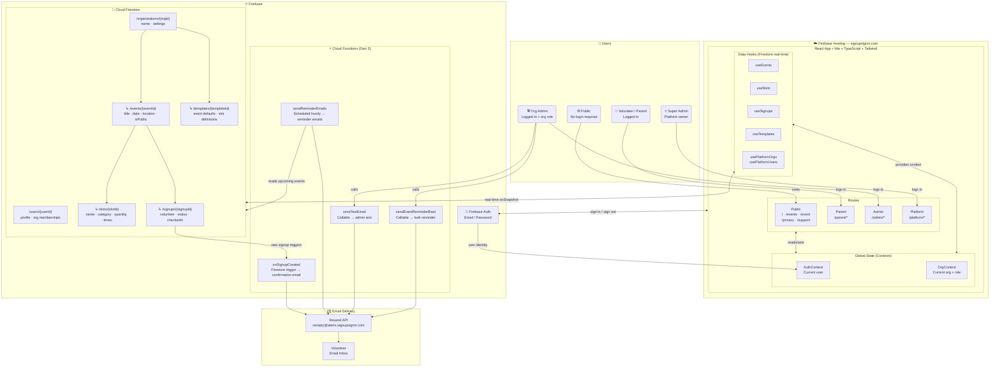

# SignupSignin — Architecture Diagram

```mermaid
flowchart TB
    %% ─── USERS ───────────────────────────────────────────────
    subgraph USERS["👥  Users"]
        direction LR
        PUB("🌐 Public\nNo login required")
        VOL("🙋 Volunteer / Parent\nLogged in")
        ADM("🛠️ Org Admin\nLogged in + org role")
        SUA("⭐ Super Admin\nPlatform owner")
    end

    %% ─── FRONTEND ────────────────────────────────────────────
    subgraph HOSTING["☁️  Firebase Hosting — signupsignin.com"]
        subgraph REACT["React App  •  Vite + TypeScript + Tailwind"]
            direction TB

            subgraph ROUTES["Routes"]
                direction LR
                R_PUB["Public\n/ · /events · /event\n/privacy · /support"]
                R_PAR["Parent\n/parent/*"]
                R_ADM["Admin\n/admin/*"]
                R_PLT["Platform\n/platform/*"]
            end

            subgraph STATE["Global State (Contexts)"]
                direction LR
                CTX_AUTH["AuthContext\nCurrent user"]
                CTX_ORG["OrgContext\nCurrent org + role"]
            end

            subgraph HOOKS["Data Hooks (Firestore real-time)"]
                direction LR
                H1["useEvents"]
                H2["useSlots"]
                H3["useSignups"]
                H4["useTemplates"]
                H5["usePlatformOrgs\nusePlatformUsers"]
            end
        end
    end

    %% ─── FIREBASE ────────────────────────────────────────────
    subgraph FIREBASE["🔥  Firebase"]
        AUTH["🔐 Firebase Auth\nEmail / Password"]

        subgraph FS["📄 Cloud Firestore"]
            direction TB
            D_USERS["/users/{userId}\nprofile · org memberships"]
            D_ORGS["/organizations/{orgId}\nname · settings"]
            D_EVENTS["↳ /events/{eventId}\ntitle · date · location · isPublic"]
            D_SLOTS["  ↳ /slots/{slotId}\nname · category · quantity · times"]
            D_SIGNUPS["  ↳ /signups/{signupId}\nvolunteer · status · checkedIn"]
            D_TMPL["↳ /templates/{templateId}\nevent defaults · slot definitions"]
        end

        subgraph CF["⚡ Cloud Functions  (Gen 2)"]
            direction TB
            F1["onSignupCreated\nFirestore trigger → confirmation email"]
            F2["sendReminderEmails\nScheduled hourly → reminder emails"]
            F3["sendTestEmail\nCallable → admin test"]
            F4["sendEventReminderBlast\nCallable → bulk reminder"]
        end
    end

    %% ─── EMAIL ───────────────────────────────────────────────
    subgraph EMAIL["✉️  Email Delivery"]
        RESEND["Resend API\nnoreply@alerts.signupsignin.com"]
        INBOX["Volunteer\nEmail Inbox"]
    end

    %% ─── USER → APP ──────────────────────────────────────────
    PUB -->|visits| R_PUB
    VOL -->|logs in| R_PAR
    ADM -->|logs in| R_ADM
    SUA -->|logs in| R_PLT

    %% ─── APP INTERNAL ────────────────────────────────────────
    ROUTES <-->|reads/sets| STATE
    STATE <-->|provides context| HOOKS

    %% ─── APP → FIREBASE ──────────────────────────────────────
    REACT <-->|sign in / sign out| AUTH
    AUTH -->|user identity| CTX_AUTH
    HOOKS <-->|real-time onSnapshot| FS

    %% ─── FIRESTORE STRUCTURE ─────────────────────────────────
    D_ORGS --> D_EVENTS
    D_EVENTS --> D_SLOTS
    D_EVENTS --> D_SIGNUPS
    D_ORGS --> D_TMPL

    %% ─── FIRESTORE → FUNCTIONS ───────────────────────────────
    D_SIGNUPS -->|new signup triggers| F1
    F2 -->|reads upcoming events| FS
    ADM -->|calls| F3
    ADM -->|calls| F4

    %% ─── FUNCTIONS → EMAIL ───────────────────────────────────
    F1 --> RESEND
    F2 --> RESEND
    F3 --> RESEND
    F4 --> RESEND
    RESEND --> INBOX
```

---

> **Rendering:** This diagram renders automatically on GitHub. To preview locally, paste the code block at [mermaid.live](https://mermaid.live).
